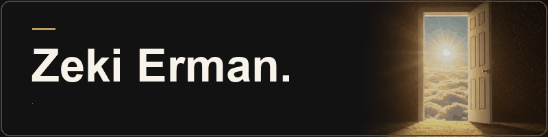

  

  Computer Engineering student building mobile apps, websites, and tools for AI coding agents. 
  <em>Vibe coder since localhost:3000.</em>

 

<table width="100%">
  <tr><td colspan="2"><strong>01 / FEATURED BUILD</strong></td></tr>
  <tr>
    <td valign="middle"><h2> Pandoo</h2></td>
    <td align="right" valign="middle"></td>
  </tr>
  <tr><td colspan="2">
    
<strong>Discover, scan, earn — for Konya's cafés and patisseries.</strong>

    
Pandoo brings local café discovery, events, and digital loyalty into one app. Browse cafés and activities such as film nights, acoustic evenings, board-game nights, and workshops. Cafés can also share campaigns and announcements.

    
At a participating cafe, scan the counter QR for a digital stamp. It rotates every 30 seconds so a screenshot cannot be reused. I co-founded Pandoo and built the app with a friend using React Native, Expo, and Supabase. It is live on both stores.

  </td></tr>
  <tr><td colspan="2" align="center">
    <table width="100%">
      <tr>
        <td width="50%" height="68" align="center" valign="middle"></td>
        <td width="50%" height="68" align="center" valign="middle"></td>
      </tr>
    </table>
  </td></tr>
</table>

 

<table width="100%">
  <tr><td><strong>02 / PERSONAL SITE</strong></td></tr>
  <tr><td>
    <h3><a href="https://zekierman.me">zekierman.me ↗</a></h3>
    
My bilingual site, built with Astro and a scroll-scrubbed cinematic hero.

  </td></tr>
</table>

 

<table width="100%">
  <tr><td><strong>03 / OPEN SOURCE</strong></td></tr>
  <tr><td>
    <h3><a href="https://github.com/zekierman/orkestra">orkestra ↗</a></h3>
    
A Claude Code skill and plugin that runs Claude Code, Codex, and Antigravity side by side in herdr under one coordinator. Task specs in, file-based results and verified claims out, one answer back.

    
<code>/plugin marketplace add zekierman/orkestra</code>

    

  </td></tr>
</table>

 

<table width="100%">
  <tr><td>
    <h3><a href="https://github.com/zekierman/kavra">kavra ↗</a></h3>
    
A study partner skill for university courses. It probes what you know, plans the topic, teaches from your own sources, and keeps spaced review in Obsidian.

    
<code>/plugin marketplace add zekierman/kavra</code>

    

  </td></tr>
</table>

Apple and the Apple logo are trademarks of Apple Inc., registered in the U.S. and other countries.
