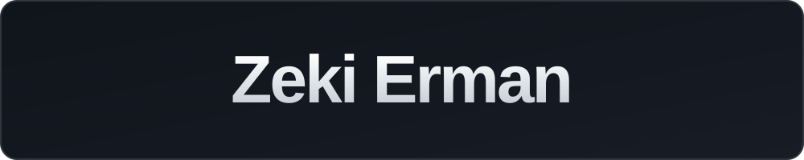
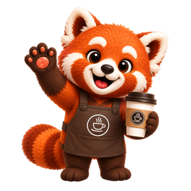

  

  Computer Engineering student building mobile apps, websites, and tools for AI coding agents. 
  <em>Vibe coder since localhost:3000.</em>

<table width="100%">
  <tr><td colspan="2"><strong>01 / OPEN SOURCE</strong></td></tr>
  <tr>
    <td width="50%" valign="top">
      
      <h3><a href="https://github.com/zekierman/orkestra">orkestra ↗</a></h3>
      
A Claude Code skill and plugin that runs Claude Code, Codex, and Antigravity side by side in herdr under one coordinator. Task specs in, file-based results and verified claims out, one answer back.

      
<code>/plugin marketplace add zekierman/orkestra</code>

    </td>
    <td width="50%" valign="top">
      
      <h3><a href="https://github.com/zekierman/kavra">kavra ↗</a></h3>
      
A study partner skill for university courses. It probes what you know, plans the topic, teaches from your own sources, and keeps spaced review in Obsidian.

      
<code>/plugin marketplace add zekierman/kavra</code>

    </td>
  </tr>
</table>

<table width="100%">
  <tr><td colspan="2"><strong>02 / FEATURED BUILD</strong></td></tr>
  <tr>
    <td width="74%" valign="top">
      <h2> Pandoo</h2>
      
<strong>Discover, scan, earn — for Konya's cafés and patisseries.</strong>

      
Pandoo brings local café discovery, events, and digital loyalty into one app. Explore cafés and activities such as film nights, acoustic evenings, board-game nights, and workshops. At the counter, scan the café's QR code to collect a digital stamp; the code rotates every 30 seconds to prevent screenshot reuse. Cafés can share campaigns and announcements, too.

      
I co-founded Pandoo and built the mobile app with a friend using React Native, Expo, and Supabase. It is live on the App Store and Google Play.

    </td>
    <td width="26%" align="center" valign="middle">
      
    </td>
  </tr>
  <tr>
    <td colspan="2" align="center">
      
      &nbsp;&nbsp;
      
    </td>
  </tr>
  <tr>
    <td colspan="2">Also built: <a href="https://zekierman.me"><strong>zekierman.me ↗</strong></a>, my bilingual personal site (Astro, scroll-scrubbed cinematic hero).</td>
  </tr>
</table>
